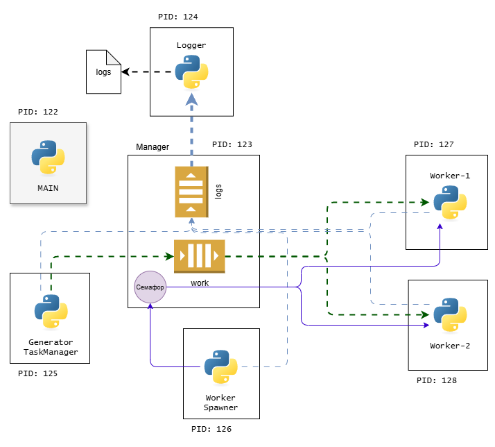

### **1️⃣ Главный процесс (main)**

* Создаётся **Manager**, который управляет общими объектами между процессами (`Queue` и `Semaphore`).
* Создаются три объекта:

  * `work_queue` — очередь для работы (данные, которые должны обрабатывать worker’ы).
  * `log_queue` — очередь для логирования.
  * `semaphore` — семафор на 3 разрешения, чтобы одновременно могло работать не больше 3 worker’ов.
* Запускаются три типа дочерних процессов:

  - **Генератор данных** (`generator_process`) — кладёт случайные числа в `work_queue`.
  - **Спавнер worker’ов** (`worker_spawner_process`) — запускает новые worker-процессы, контролируя их количество через семафор.
  - **Logger** (`logger_process`) — читает сообщения из `log_queue` и записывает их в файл `log.txt`.
* Основной процесс ждёт завершения этих процессов с помощью `.join()`. Если пользователь прерывает программу (`Ctrl+C`), все дочерние процессы завершаются.

---

### **2️⃣ Logger процесс**

* Функция `logger(log_queue)`:

  * Создаёт и открывает файл `log.txt`.
  * Пишет в файл, что логгер стартовал, с PID.
  * В бесконечном цикле:

    * Берёт сообщение из `log_queue`.
    * Печатает его на экран.
    * Записывает в файл.
* **Назначение:** централизованное логирование всех событий, которые происходят в worker’ах и спавнере.

---

### **3️⃣ Генератор данных (`generator_process`)**

* Функция `generator(work_queue)`:

  * В бесконечном цикле кладёт случайное число от 0 до 100 в `work_queue`.
  * Ждёт случайное время до 2 секунд.
* **Назначение:** генерировать поток данных для обработки worker’ами.

---

### **4️⃣ Worker Spawner процесс**

* Функция `worker_spawner(work_queue, log_queue, semaphore)`:

  * Логирует запуск спавнера.
  * В бесконечном цикле:

    * Вызывает `semaphore.acquire()`. Это означает, что если уже работают 3 worker’а (семафор 0), новые не будут запускаться.
    * Создаёт новый worker-процесс `worker`, передавая ему номер, очереди и семафор.
    * Запускает worker.
    * Увеличивает счётчик `worker_num`.
* **Назначение:** динамически создавать worker’ов, но контролировать их количество через семафор.

---

### **5️⃣ Worker процессы**

* Функция `worker(work_queue, log_queue, worker_num, semaphore)`:

  * Логирует запуск worker’а.
  * В бесконечном цикле:

    * Берёт элемент из `work_queue`.
    * Логирует, что получил данные.
    * Вызывает `simulate_data(data)` — имитация обработки данных.

      * Функция делает `sleep(1)` и случайно может выкинуть `ValueError`, если число < 10.
  * В блоке `finally`:

    * Освобождает семафор (`semaphore.release()`), чтобы спавнер мог создать нового worker’а.
    * Логирует завершение работы.
* **Назначение:** параллельная обработка данных из очереди.

---

### **6️⃣ Семафор**

* `mp.Semaphore(3)` гарантирует, что одновременно не будет работать больше 3 worker’ов.
* В сочетании со спавнером это контролирует **конкурентность** обработки данных.

---

### **7️⃣ Механизм взаимодействия**

* **Queues** (`work_queue`, `log_queue`) используются для обмена данными между процессами:

  * `work_queue` — данные от генератора к worker’ам.
  * `log_queue` — события от worker’ов и спавнера к logger’у.
* **Семафор** ограничивает количество одновременно работающих worker’ов.

---

### **Итог**

* **Главный процесс** — координирует запуск всех дочерних процессов.
* **Logger** — централизованное логирование.
* **Generator** — создаёт данные для обработки.
* **Worker Spawner** — создаёт worker’ов динамически, но ограничивает их количество.
* **Worker** — обрабатывает данные, логирует события и освобождает семафор после завершения.

---
